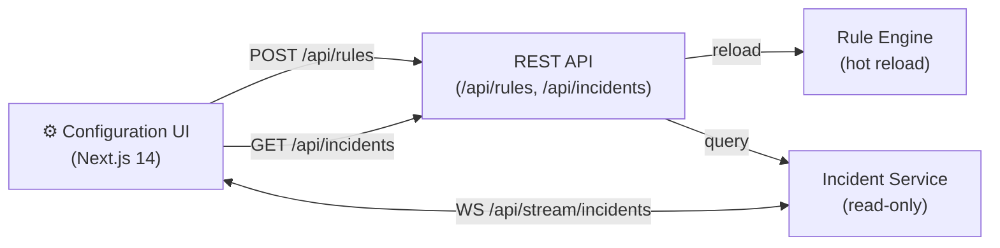

# SafeVision

Industrial computer vision safety platform for automotive manufacturing facilities. Detects PPE violations, restricted zone entries, and dangerous machinery proximity in real time — from factory floor RTSP video streams to WhatsApp alerts in under 5 seconds.

## Architecture

```mermaid
flowchart LR
    CAM["📷 RTSP Camera(s)"]
    ING["Ingestion Service\n(PyAV + shared memory)"]
    INF["Inference Service\n(YOLOv8 + ByteTrack)"]
    RE["Rule Engine\n(YAML rules, hot reload)"]
    INC["Incident Service\n(FastAPI + Postgres + MinIO)"]
    NOT["Notification Service\n(FastAPI + n8n webhooks)"]
    EXT["📱 WhatsApp / Email\n(via n8n)"]

    CAM -->|RTSP/RTMP| ING
    ING -->|frames via shared memory| INF
    INF -->|detections.frame stream| RE
    RE -->|events.violation stream| INC
    INC -->|incident created event| NOT
    NOT -->|webhook| EXT
```





## Services

| Service | Port | Tech | Purpose |
|---|---|---|---|
| ingestion | — | Python 3.11, PyAV | RTSP decode, frame sampling, shared memory buffer |
| inference | — | Python 3.11, YOLOv8, ByteTrack | Object detection + tracking, publishes to Redis |
| rule-engine | — | Python 3.11, Pydantic | Evaluates YAML rules against detections |
| incident | 8001 | Python 3.11, FastAPI, Postgres | Persists violations, stores clips, REST + WebSocket API |
| notification | 8002 | Python 3.11, FastAPI | Routes alerts to n8n webhooks |
| web | 3000 | Next.js 14, TypeScript | Incident dashboard + rule builder UI |

## Infrastructure

| Service | Port | Purpose |
|---|---|---|
| PostgreSQL 16 + TimescaleDB | 5432 | Incident metadata, rule storage |
| Redis 7 | 6379 | Redis Streams (inter-service events), dead-letter queue |
| MinIO | 9000 / 9001 | Incident video clip storage (S3-compatible) |
| n8n | 5678 | Workflow automation (WhatsApp, Email routing) |
| Prometheus | 9090 | Metrics collection |
| Grafana | 3001 | Dashboards (Plant Overview, Per-Camera Health, Incident Funnel) |
| Loki | 3100 | Log aggregation |

## Quickstart (dev)

**Prerequisites:** Docker 24+, Docker Compose v2, Git.

```bash
git clone https://github.com/dmitriidrugov/safevision.git
cd safevision

# Copy and edit environment variables
cp infra/docker-compose/.env.example infra/docker-compose/.env
# Edit infra/docker-compose/.env — change passwords before running

# Boot infrastructure services
docker compose -f infra/docker-compose/docker-compose.yml up -d

# Verify all services are healthy
docker compose -f infra/docker-compose/docker-compose.yml ps
```

Access points after boot:
- Grafana: http://localhost:3001 (admin / see .env)
- MinIO Console: http://localhost:9001 (minioadmin / see .env)
- n8n: http://localhost:5678
- Prometheus: http://localhost:9090

## Development Milestones

| Milestone | Scope | Status |
|---|---|---|
| M1 | Ingestion + Inference, single camera, console output | ✅ |
| M2 | Rule Engine + Redis Streams, synthetic incidents | ✅ |
| M3 | Incident Service + Postgres + MinIO clips | ✅ |
| M4 | Notification Service + n8n + WhatsApp demo | ✅ |
| M5 | Configuration UI — dashboard, rule list, zone editor | ✅ |
| M6 | Chat-based rule builder (OpenRouter / Llama) | ✅ |
| M7 | CI/CD, observability stack, Grafana dashboards | ✅ |
| M8 | E2E tests, load tests, LLM eval, Helm chart | ✅ |
| Hardening | JWT auth, rate limiting, RTSP encryption, camera hot-reload | ✅ |
| Ops | Model auto-download, n8n workflows, integration tests | ✅ |

## Further Reading

- [Architecture](docs/ARCHITECTURE.md)
- [Runbook](docs/RUNBOOK.md)
- [Rule Authoring Guide](docs/RULE-AUTHORING.md)
- Service READMEs: [ingestion](services/ingestion/README.md) · [inference](services/inference/README.md) · [rule-engine](services/rule-engine/README.md) · [incident](services/incident/README.md) · [notification](services/notification/README.md) · [web](web/app/README.md)
