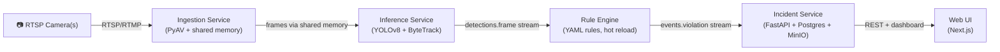

# SafeVision

Industrial computer-vision safety platform for automotive manufacturing facilities. Detects PPE violations, restricted-zone entries, and dangerous-machinery proximity in real time. All incidents surface in the SafeVision web UI — there is no out-of-band WhatsApp / email / webhook channel.

The repo ships **two deployment paths** that share the same UI codebase:

| Path | Where it runs | Backend | Best for |
|---|---|---|---|
| **Demo (Vercel)** | A single Next.js app, frontend-only | YOLOv8n inference runs in the browser via `onnxruntime-web`; pairs phones via WebRTC | Showcasing the product end-to-end without standing up infra |
| **Full stack (Docker Compose)** | 4 Python microservices + Postgres + Redis + MinIO + Prometheus + Grafana + Loki | Production-style pipeline | Local development, integration tests, and realistic load |

## Live demo flow

```
┌─────────────────────────────────────────────────────────────┐
│  Vercel — Next.js                                           │
│  ┌──────────────────┐   ┌──────────────────────────────┐    │
│  │ /publish/[peer]  │   │ /cameras, /live, /, /rules,  │    │
│  │ (phone — camera) │   │ /incidents, /configure       │    │
│  └────────┬─────────┘   └──────────────┬───────────────┘    │
│           │                            │                    │
│           │       WebRTC P2P           │                    │
│           └──────────┬─────────────────┘                    │
│                      │ signaling                            │
└──────────────────────┼──────────────────────────────────────┘
                       │
              ┌────────▼────────┐
              │ PeerJS public   │   ← free, no auth, no infra
              │ broker          │
              └─────────────────┘

In the desktop browser:
  • <video> element receives the WebRTC stream
  • OffscreenCanvas captures frames into a Web Worker
  • YOLOv8n COCO model runs via onnxruntime-web (WASM SIMD / WebGPU)
  • Detections are drawn on a transparent overlay canvas
  • Rule evaluator (TS port of services/rule-engine) checks each frame
  • Matched rules become Incidents → IndexedDB → Dashboard + /incidents
```

### Try it locally (Vercel-equivalent)

```bash
cd web/app
npm install --legacy-peer-deps
NEXT_PUBLIC_DEMO_MODE=true npm run dev
```

Open `http://localhost:3000/login`, click **Try the demo**, then:

1. Go to **Cameras** → **Pair camera**.
2. Scan the QR with your phone (camera app on the same network — but any network works since signaling is via the PeerJS cloud broker).
3. Allow camera access on the phone.
4. The live tile appears on desktop. Open it for full-screen view with detection overlay.
5. Draw zones in the **Zones** editor; rules fire when conditions match and incidents stream to the Dashboard.

### Deploy to Vercel

The repo's `vercel.json` already configures the build:

```bash
# Option 1 — CLI
npx vercel --prod

# Option 2 — Git integration
# Connect the repo in Vercel UI. Root directory: leave as repo root.
# The default build will pick up vercel.json.
```

`NEXT_PUBLIC_DEMO_MODE=true` is baked into `vercel.json`, so cloud builds default to demo mode automatically. To enable the LLM rule builder, set `OPENROUTER_API_KEY` in Vercel project settings.

## Full-stack architecture (Docker Compose path)



### Services

| Service | Port | Tech | Purpose |
|---|---|---|---|
| ingestion | — | Python 3.11, PyAV | RTSP decode, frame sampling, shared memory buffer |
| inference | — | Python 3.11, YOLOv8, ByteTrack | Object detection + tracking, publishes to Redis |
| rule-engine | 8003 | Python 3.11, Pydantic | Evaluates YAML rules against detections |
| incident | 8004 | Python 3.11, FastAPI, Postgres | Persists violations, stores clips, REST API |
| web | 3000 | Next.js 15, TypeScript | Incident dashboard + rule builder UI |

### Infrastructure

| Service | Port | Purpose |
|---|---|---|
| PostgreSQL 16 + TimescaleDB | 5432 | Incident metadata, rule storage |
| Redis 7 | 6379 | Redis Streams (inter-service events) |
| MinIO | 9000 / 9001 | Incident video clip storage (S3-compatible) |
| Prometheus | 9090 | Metrics collection |
| Grafana | 3001 | Dashboards (Plant Overview, Per-Camera, Incident Funnel) |
| Loki | 3100 | Log aggregation |
| MediaMTX | 8554 / 8888 / 8889 | Local RTSP/HLS/WebRTC test server |

### Quickstart (local dev)

**Prerequisites:** Docker 24+, Docker Compose v2, Git.

```bash
git clone https://github.com/dmitriidrugov/safevision.git
cd safevision

cp infra/docker-compose/.env.example infra/docker-compose/.env
# Edit infra/docker-compose/.env — change passwords before running

docker compose -f infra/docker-compose/docker-compose.yml up -d
docker compose -f infra/docker-compose/docker-compose.yml ps
```

Access points after boot:
- Web UI: http://localhost:3000  *(`NEXT_PUBLIC_DEMO_MODE=false` so it talks to the backend)*
- Grafana: http://localhost:3001 (admin / see `.env`)
- MinIO Console: http://localhost:9001
- Prometheus: http://localhost:9090

## Repository layout

```
services/          # Four Python microservices (ingestion, inference, rule-engine, incident)
web/app/           # Next.js 15 dashboard, demo mode, browser inference, WebRTC pairing
shared/            # Pydantic schemas and Redis Stream proto models (imported by all Python services)
infra/             # docker-compose stack, Helm chart, Grafana dashboards, Prometheus rules
tests/             # unit, integration, e2e, load, llm-eval test suites
docs/              # ARCHITECTURE.md, RUNBOOK.md, RULE-AUTHORING.md
vercel.json        # Vercel deployment config (demo mode)
```

## Development milestones

| Milestone | Scope | Status |
|---|---|---|
| M1 | Ingestion + Inference, single camera, console output | ✅ |
| M2 | Rule Engine + Redis Streams, synthetic incidents | ✅ |
| M3 | Incident Service + Postgres + MinIO clips | ✅ |
| M5 | Configuration UI — dashboard, rule list, zone editor | ✅ |
| M6 | Chat-based rule builder (OpenRouter / Llama) | ✅ |
| M7 | CI/CD, observability stack, Grafana dashboards | ✅ |
| M8 | E2E tests, load tests, LLM eval, Helm chart | ✅ |
| Hardening | JWT auth, rate limiting, RTSP encryption, camera hot-reload | ✅ |
| Showcase | Vercel-ready frontend-only mode, WebRTC pairing, browser-side YOLOv8 inference, redesigned dashboard | ✅ |
| **Dashboard-only** | Removed legacy notification service, n8n workflows, and channel field — incidents are observed only in the web UI | ✅ |

## Further reading

- [Architecture](docs/ARCHITECTURE.md)
- [Runbook](docs/RUNBOOK.md)
- [Rule Authoring Guide](docs/RULE-AUTHORING.md)
- Service READMEs: [ingestion](services/ingestion/README.md) · [inference](services/inference/README.md) · [rule-engine](services/rule-engine/README.md) · [incident](services/incident/README.md) · [web](web/app/README.md)
